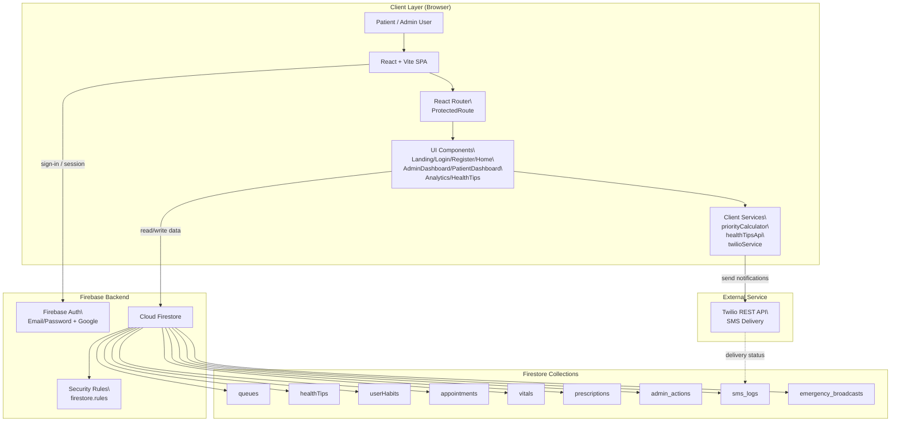

# System Architecture

This document describes the high-level architecture of the Hospital Queue Management System.

## Overview

## Notes

- The frontend is a single-page React application served by Vite.
- Firebase Auth protects routes and user sessions.
- Firestore stores queue, health tips, dashboard, and audit data.
- Twilio is used for SMS notifications from dashboard workflows.
